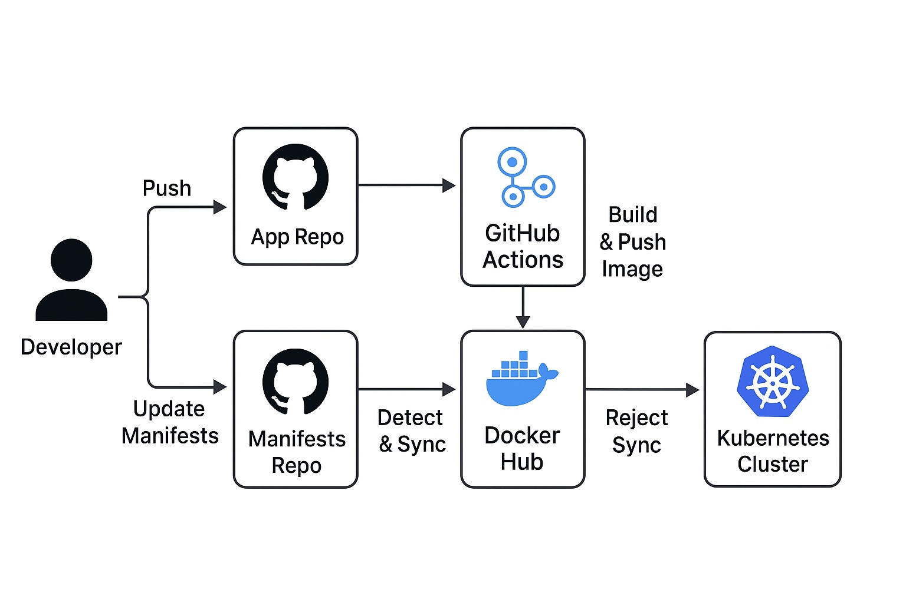

# End-to-End DevOps Project: A GitOps CI/CD Pipeline
[](https://github.com/sudlo/CI-CD/actions/workflows/ci-pipeline.yml)

This project demonstrates a fully automated CI/CD pipeline for a simple Python web application using modern DevOps tools. The entire workflow is built on the principles of GitOps, where Git is the single source of truth for both application code and infrastructure configuration.


---

### ## 🚀 Workflow Overview

This diagram illustrates the complete CI/CD pipeline from code commit to deployment:

1. **CI (Continuous Integration)**: A push to the `main` branch triggers a **GitHub Actions** workflow. It builds the application into a **Docker** image and pushes it to a container registry (Docker Hub).
2. **CD (Continuous Deployment)**: **ArgoCD** is continuously monitoring the Git repository. When it detects a change in the Kubernetes manifests (e.g., a new image tag), it automatically syncs the changes to the **Kubernetes** cluster, triggering a rolling update of the application.

---

### ## 🛠️ Technologies Used

* **Version Control**: Git & GitHub
* **CI Automation**: GitHub Actions
* **Containerization**: Docker
* **Container Orchestration**: Kubernetes (Minikube)
* **CD & GitOps**: ArgoCD

---

### ## 📂 Project Structure

```
.
├── .github/
│   └── workflows/
│       └── ci-pipeline.yml    # CI workflow for building Docker images
├── k8s/
│   ├── deployment.yaml        # K8s deployment manifest
│   └── service.yaml           # K8s service manifest
├── app.py                     # Simple Python Flask application
├── Dockerfile                 # Instructions to build the Docker image
└── requirements.txt           # Python dependencies
```

---

### ## 🔧 How to Replicate This Project

To run this project, you'll need a Kubernetes cluster and the following tools installed: `git`, `docker`, `kubectl`.

1. **Fork & Clone the Repository**:

    ```bash
    git clone [https://github.com/YOUR_USERNAME/devops-demo-project.git](https://github.com/YOUR_USERNAME/devops-demo-project.git)
    cd devops-demo-project
    ```

2. **Set Up Secrets**: In your forked GitHub repository, go to `Settings > Secrets and variables > Actions` and add your Docker Hub credentials:
    * `DOCKERHUB_USERNAME`: Your Docker Hub username.
    * `DOCKERHUB_TOKEN`: Your Docker Hub access token.

3. **Deploy ArgoCD**: Install ArgoCD on your Kubernetes cluster.

    ```bash
    kubectl create namespace argocd
    kubectl apply -n argocd -f [https://raw.githubusercontent.com/argoproj/argo-cd/stable/manifests/install.yaml](https://raw.githubusercontent.com/argoproj/argo-cd/stable/manifests/install.yaml)
    ```

4. **Connect ArgoCD to Your Repo**: Configure an ArgoCD application to point to the `k8s` directory in your forked repository.

Now, any change you make to the app code or manifests will automatically be built and deployed!
